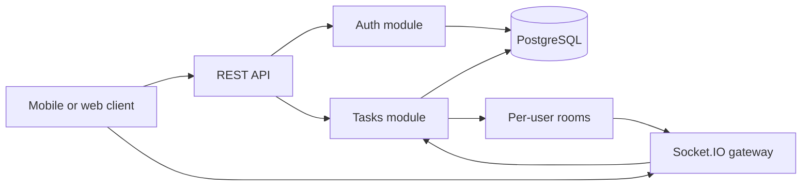

# To-Do Service

A production-style backend for a mobile task-management application.

The service is built with NestJS and PostgreSQL and demonstrates authentication, migrations, real-time user-specific events, API protection, soft deletion, and isolated end-to-end testing.

## Main capabilities

### Authentication

- Register a user
- Log in with email and password
- Receive a JWT access token
- Protect task endpoints with bearer authentication

### Task management

- Create a task
- Get an individual task
- List active tasks
- Filter tasks by status
- Paginate and order task collections
- Update an active task
- Archive a task through soft deletion
- Read archived tasks separately

## Architecture



## Stack

- TypeScript
- NestJS
- PostgreSQL
- TypeORM
- Passport JWT
- bcrypt
- Socket.IO
- Swagger
- Helmet
- NestJS Throttler
- Docker and Docker Compose
- Jest
- Supertest
- Testcontainers

## Getting Started

### Using Docker

```bash
docker compose up --build
```

This command starts PostgreSQL and the application at `http://localhost:3000`.

---

### Running Locally

```bash
docker compose up postgres -d   # start PostgreSQL only
npm install
cp .env.example .env
npm run migration:run           # apply database migrations
npm run dev                     # start in watch mode
```

## Environment Variables

Environment variables are documented in [.env.example](.env.example).

| Variable         | Purpose                  | Default         |
|------------------|--------------------------|-----------------|
| `PORT`           | Application port         | `3000`          |
| `DB_*`           | PostgreSQL connection    | See the example |
| `JWT_SECRET`     | Secret used to sign JWTs | —               |
| `JWT_EXPIRES_IN` | Token expiration time    | `1h`            |

> `JWT_SECRET` is required. The application will not start without it. Use your own secure value in production.

## API

The global API prefix is `/api`.

Swagger UI is available at `http://localhost:3000/docs`.

| Method   | Path                  | Description                                     | Auth |
|----------|-----------------------|-------------------------------------------------|------|
| `POST`   | `/api/auth/register`  | Register a user and return an access token      | —    |
| `POST`   | `/api/auth/login`     | Log in and return an access token               | —    |
| `POST`   | `/api/tasks`          | Create a task                                   | JWT  |
| `GET`    | `/api/tasks`          | Get active tasks with filtering and pagination  | JWT  |
| `GET`    | `/api/tasks/archived` | Get archived tasks in read-only mode            | JWT  |
| `GET`    | `/api/tasks/:id`      | Get a task by ID                                | JWT  |
| `PATCH`  | `/api/tasks/:id`      | Update an active task                           | JWT  |
| `DELETE` | `/api/tasks/:id`      | Archive a task using soft delete, returns `204` | JWT  |

Available task statuses:

- `todo`
- `in_progress`
- `done`

Pagination parameters:

- `page` — page number, must be at least `1`
- `limit` — number of items per page, from `1` to `100`
- `order` — sorting order: `ASC` or `DESC`

## Rate Limiting

Separate rate limits are applied globally and to authentication endpoints using the throttler.

When a limit is exceeded, the API returns `429 Too Many Requests`.

| Scope         | Limit        | Window     | Environment Variables                      |
|---------------|--------------|------------|--------------------------------------------|
| All endpoints | 100 requests | 60 seconds | `THROTTLE_TTL`, `THROTTLE_LIMIT`           |
| `/api/auth/*` | 10 requests  | 60 seconds | `THROTTLE_AUTH_TTL`, `THROTTLE_AUTH_LIMIT` |

## WebSocket

Real-time notifications are provided through Socket.IO using the `/tasks` namespace.

Authentication is performed during the handshake. The access token can be passed through `auth.token` or through the following header:

```text
Authorization: Bearer <token>
```

The connection is terminated if the token is missing or invalid.

Each connected client joins a private room and receives events only for their own tasks.

| Event          | Payload   | Trigger                  |
|----------------|-----------|--------------------------|
| `task.created` | `TaskDto` | `POST /api/tasks`        |
| `task.updated` | `TaskDto` | `PATCH /api/tasks/:id`   |
| `task.deleted` | `{ id }`  | `DELETE /api/tasks/:id`  |

### Connection Example

```js
import { io } from 'socket.io-client';

const socket = io('http://localhost:3000/tasks', {
  auth: { token: '<accessToken>' },
});

socket.on('task.created', (task) => console.log('created', task));
socket.on('task.updated', (task) => console.log('updated', task));
socket.on('task.deleted', ({ id }) => console.log('deleted', id));
```

## cURL Examples

### Register a User

You can also use the `login` endpoint. The response contains an `accessToken`.

```bash
curl -X POST http://localhost:3000/api/auth/register \
  -H 'Content-Type: application/json' \
  -d '{"email":"user@example.com","password":"password123"}'
```

Use the returned token in the `Authorization` header:

```bash
TOKEN=<accessToken>
```

### Create a Task

```bash
curl -X POST http://localhost:3000/api/tasks \
  -H "Authorization: Bearer $TOKEN" \
  -H 'Content-Type: application/json' \
  -d '{"title":"Buy groceries","description":"Milk, eggs, bread","status":"todo"}'
```

### Get Active Tasks

```bash
curl "http://localhost:3000/api/tasks?status=todo&page=1&limit=20" \
  -H "Authorization: Bearer $TOKEN"
```

### Get Archived Tasks

```bash
curl http://localhost:3000/api/tasks/archived \
  -H "Authorization: Bearer $TOKEN"
```

### Update a Task

```bash
curl -X PATCH http://localhost:3000/api/tasks/<id> \
  -H "Authorization: Bearer $TOKEN" \
  -H 'Content-Type: application/json' \
  -d '{"status":"done"}'
```

### Archive a Task

```bash
curl -X DELETE http://localhost:3000/api/tasks/<id> \
  -H "Authorization: Bearer $TOKEN"
```

## Tests

```bash
npm run test:unit   # run unit tests
npm run test:e2e    # run E2E tests using PostgreSQL via Testcontainers
npm test            # run all tests
```
